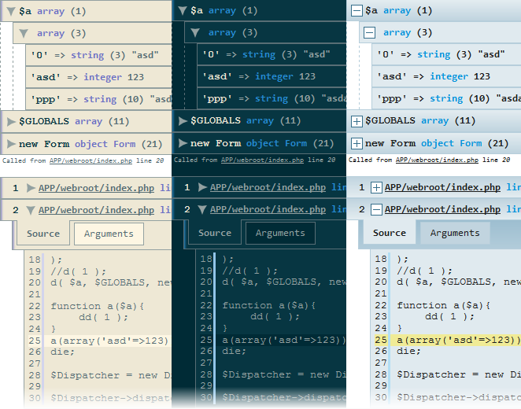

# Sage - Insightful PHP debugging assistant ☯

At first glance **Sage** is just a pretty replacement
for **[var_dump()](http://php.net/manual/en/function.var-dump.php)**
, **[print_r()](http://php.net/manual/en/function.print-r.php)**
and **[debug_backtrace()](http://php.net/manual/en/function.debug-backtrace.php)**.

However, it's much, *much* more.

Just some of the most useful features which come out of the box:

* **Variable name** is displayed (unique feature!);
* **CLI mode**
* Keyboard shortcuts! Just type <kbd>d</kbd> and the rest is just self-explanatory.
* **Debug backtraces** are finally fully readable and actually informative.
* Variable content is **displayed in the most informative way** - and you *never, ever* miss any physically available
  information about anything you are dumping.
* Custom display for a lot of recognized types:
  

## Installation and Usage

One of the main goals of Sage is to be **zero setup**.

[Download the phar](https://github.com/php-sage/sage/raw/main/sage.phar) and simply

```php
<?php
require '/sage.phar';
```

**Or, if you use Composer:**

```bash
composer require php-sage/sage --dev
```

**That's it, you can now use Sage to debug your code:**

```php
########## DUMP VARIABLE ###########################

sage($GLOBALS, $_SERVER); // any number of parameters

# or you can go shorter:
d($GLOBALS, $_SERVER);

# or you can go the verbose way, it's all the same:
Sage::dump($GLOBALS, $_SERVER); 


# s() will display a more basic, javascript-free display (but with colors)
s($GLOBALS, $_SERVER);

# prepending a tilde will make the output even more basic (rich->basic and basic->plain text)
~d($GLOBALS, $_SERVER); // how this works: https://stackoverflow.com/a/69890023/179104


########## DEBUG BACKTRACE #########################
Sage::trace();
// or via shorthand:
d(1);
// you can even pass the result of debug_trace and it will be recognized
Sage::dump( debug_backtrace() );


########## DUMP AND DIE #########################
dd($GLOBALS, $_SERVER); // dd() might be taken by your framework
ddd($GLOBALS, $_SERVER); // so here are some equivalent altenratives
saged($GLOBALS, $_SERVER);

sd($GLOBALS, $_SERVER); // for plain display


########## MISCELLANEOUS ###########################
# this will disable Sage completely
Sage::enabled(false);

ddd('Get off my lawn!'); // no effect

```

## Tips & Tricks

* Sage is enabled by default, call `Sage::enabled(false);` to turn it completely off. You might consider is to enable
  Sage in DEVELOPMENT environment only (or for example `Sage::enabled($_SERVER['REMOTE_ADDR'] === '<your IP>');`) - so
  even if you accidentally leave a dump in production, it will remain silent and not throw `Function not found`.
* Double clicking the `[+]` sign in the output will expand/collapse ALL nodes; **triple clicking** big blocks of text will
  select it all.
* Clicking the tiny arrows on the right of the output open it in a separate window where you can keep it for comparison.
* If a variable is an object, its classname can be clicked to open the class in your IDE.
* There are a couple of real-time modifiers you can use:
    * `~d($var)` this call will output in plain text format.
    * `+d($var)` will disregard depth level limits and output everything (careful, this can hang your browser on huge
      objects)
    * `!d($var)` will show expanded rich output.
    * `-d($var)` will attempt to `ob_clean` the previous output so if you're dumping something inside a HTML page, you
      will still see Sage output. You can combine some modifiers too: `~+d($var)`
* To force a specific dump output type just pass it to the `Sage::enabled()` method. Available options
  are: `Sage::MODE_RICH` (default), `Sage::MODE_PLAIN`, `Sage::MODE_WHITESPACE` and `Sage::MODE_CLI`:

```php
Sage::enabled(Sage::MODE_WHITESPACE);
$sageOutput = Sage::dump($GLOBALS); 
// now $sageOutput can be written to a text log file and 
// be perfectly readable from there
```

* To change the **theme**, use `Sage::$theme = '<theme name>';` where available options are: `'original'` (default)
  , `'solarized'`, `'solarized-dark'` and `'aante-light'`.

  
* Sage also includes a naïve profiler you may find handy. It's for determining relatively which code blocks take longer
  than others:

```php
Sage::dump( microtime() ); // just pass microtime()
sleep( 1 );
Sage::dump( microtime(), 'after sleep(1)' );
sleep( 2 );
ddd( microtime(), 'final call, after sleep(2)' );
```


----

### Author

**Rokas Šleinius** ([Raveren](https://github.com/raveren))

### License

Licensed under the MIT License

### Why does this look so much like Kint?

Because it **IS** [Kint](https://github.com/kint-php/kint), and I am its author, however the project
was [blatantly stolen](https://github.com/kint-php/kint/commit/1ea81f3add81b586756515673f8364f60feb86a3) from me by a
malicious contributor!

Instead of fighting windmills, I chose to fork and rename the last good version and continue under a new name!

---

Hope you love using Sage as much as I love creating it!
